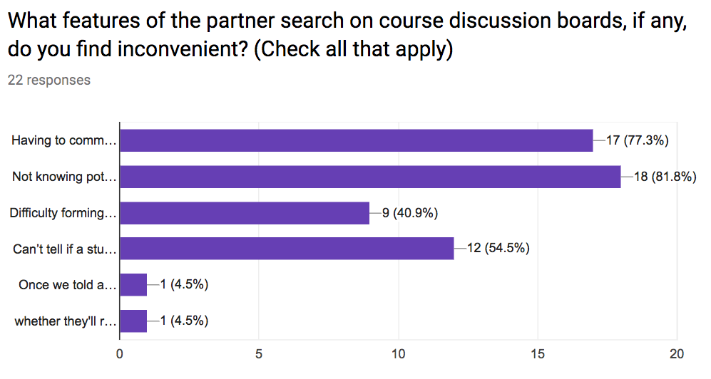
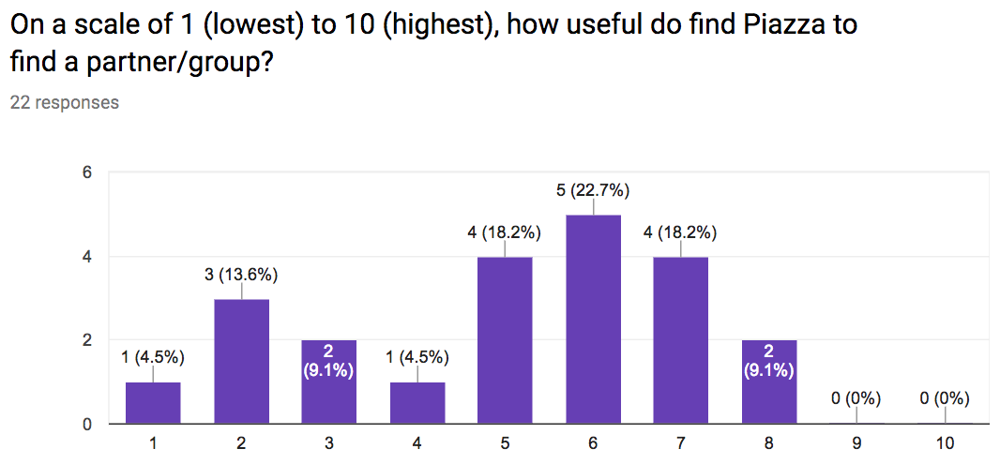
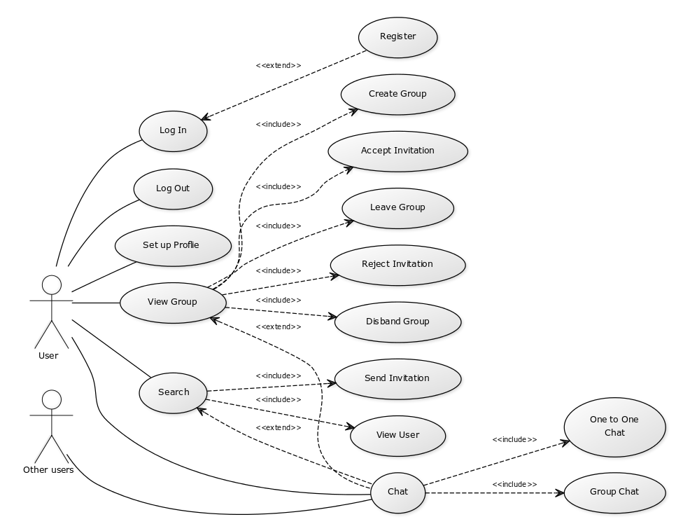
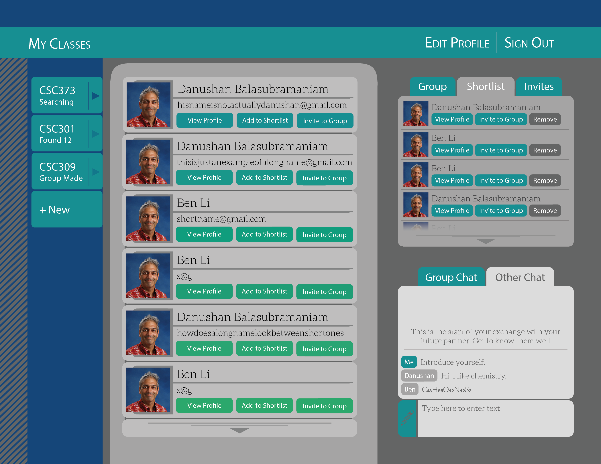

# PairWise

 > _Note:_ This document is meant to be written during (or shortly after) your initial planning meeting.
 > It does not really make sense for you to edit this document much (if at all) while working on the project - Instead, at the end of the planning phase, you can refer back to this document and decide which parts of your plan you are happy with and which parts you would like to change.


## Iteration 01

 * Start date: Feb. 1, 2018
 * End date: Feb. 9, 2018

## Process

_This entire section is optional. Note that you will have to fill it out and more for the next 3 deliverables so it's good to start soon and get feedback._

#### Roles & responsibilities

Features List, Priorities and Goals: 
The basic framework of the features and functions of the PairWise partner finding application. This consists of the features and goals necessary to achieve the Minimum Viable Product including login/logout, user profile creation, a competent search students feature, group formation/deletion as well as a chat feature. An additional list of extra features brainstormed for design extensibility. 
Contributors: Evan and Simon

User Stories, Use Cases and Personas:
An analysis of the usability of the PairWise application. This includes information about all users/stakeholders of the application, a use case model of the interactions between the multiple users and the application. Personas of potential student users included to get a shared understanding of multiple types of users (in terms of goals and capabilities).
Contributors: Salt and Cindy

UI Design:
An artifact that describes the working design of the PairWise product. It tests how appealing and interactive the PairWise product is as it includes a visual placement of multiple brainstormed features, including tools like online chat and search. 
Contributors: Alex and Deanne

The Ladder:
An artifact specifically for group organization and communication purposes, to make sure goals and deadlines are met. 
Contributors: Alex

GitHub and Slack SetUp:
A workspace for the group to organize tasks and communicate about project activity. 
Contributors: Evan

Survey:
An artifact created to get an idea of how students find course discussion boards to find partners, if they are able to find a partner and if they were satisfied with working with the partner they found. The survey’s main purpose is to reassure the major problems with students ability to find compatible partners.
Contributors: Deanne and Priyanka


#### Events

Describe meetings (and other events) you are planning to have:

  > We will hold two team meetings per week, one during tutorial on Thursday (in person) and the other on Mondays through Slack at 4:00 pm. We are considering adding one more in-person meeting on Tuesdays or Wednesdays, depending on everyone’s schedule. The purpose of these meetings will be to update the team on progress made to the project, as well as raise any concerns or planning decisions. In general, the meetings will function in the same way as scrum standups.
  > On Friday, February 9, we will hold our review meeting for the first iteration.

#### Artifacts

List/describe the artifacts you will produce in order to organize your team.

  > We will use GitHub's project taskboard to organize our backlog of tasks (features, defects, documentation...etc.) This system will remain up-to-date with our repository. We will also use a [Ladder system](https://docs.google.com/document/d/1QSICkmNKqWTZWZ_YjbdnL1I6kxU0awre4iaVYLc47ds) in parallel to this, as another place to track the progress of our tasks. See Highlights section of [product.md](./product.md) for more details.
  > We are looking into integrating the team's project workspace on Slack with GitHub, to notify the rest of the team when important events happen to the repository and the project. Currently the Slack workspace is used for group communications, file transfer, and as a site for online team meetings.

## Product

_This entire section is mandatory._

#### Goals and tasks
  >* **Settle on product idea and problem domain:**
  > We will have to pinpoint the exact nature of our product and what specific problem we are ultimately solving
  >
  >* **Identify users, develop personas and user stories:**
  > Firstly, we must identify our target audience for our website, and then create end-user perspectives on features that would be necessary in order to create a competitive product.
  >
  >* **Decide on website features:**
  > Outline all the functionality that our web application will be providing, focusing on things that will make us stand out compared to the alternatives.
  >
  >* **Prioritize website features:**
  > Implement an ordered list of most important functions/features to be implemented such that we do not run out of time
  >
  >* **Convert features into ticket lists:**
  > Essentially lay out our “to-do”s in a low level (preferably function level) list, so that we can differentiate between what is being done, and what needs to be done.
  >
  >* **Develop use cases:**
  > Create diagrams that illustrate the steps users (actors) must take in order to achieve certain goals on our website
  >
  >* **Design webpage layout:**
  > Organize our ideas into an easily navigable, and clean user interface. 

#### Artifacts

List/describe the artifacts you will produce in order to present your project idea.

The artifacts created as of yet:

* **Survey Information:** A survey was conducted to several Computer Science students at UofT, which gathered information about the effectiveness of the 'partner finding feature' in current course discussion boards. Questions regarding the issues with such discussion boards including poor communication, difficulty of forming groups, or inability to find compatible partners were also asked. The results of the survey were reassuring, and further supported the necessity of building a school parter finding application. 
  
  
  


* **Feature List:** This list describes which features must be implemented in
  our viable product, and which features should be put off until the core
  functionality is present. We will use this list as a springboard for
  designating roles and responsibilities in the coming iterations.

```markdown
# Features required for MVP
- web interface with user accounts (need active searches to be persistent)
- user profiles: can include profile picture, bio, skills, etc.
- allow searching for partners using (at least) these core criteria:
  - course
  - time investment
  - meeting location (on campus/online/suburbs)
- allow users to view their list of potential matches for a given search;
  should be able to click to see profile, send message, send invitation, etc.
- allow users to create multiple searches (probably one per class; this might
  be restrictive for some use cases, but I think it makes sense for MVP)
- must accommodate individuals searching for groups, groups searching for
  individuals, individuals forming pairs, etc.
- show email so people can get in touch (ideally we implement chat later so
  we can bypass email altogether)
- provide methods for users to form/disband groups, send invitations,
  accept/reject invitations
- when a group reaches its desired capacity, the group members should removed
  from the active search pool

# Bonus features
- allow chat between potential partners
  - need to look into implementation overhead for realtime chat vs. sending
    email-style messages; if there are good libraries out there, we should aim
    for chat
- mobile app (or ensure mobile-friendliness)
- search based on additional criteria; some old and new ideas include:
  - skill set, such as specific languages, frontend/backend, databases, etc
  - GPA
  - personality traits
  - schedule
- notifications when new matches are found (mobile, email, etc)
- search for teammates for side projects (easy to implement)
- search for services: tutoring, textbooks, etc. (would require more work;
  probably outside the scope of this project)
- allow use by other departments/schools/groups
- rating partners
- hide people from searches (e.g. you read their profile and don't want to
  work with them, so you can remove them from your list of matches)
```

  * **Use Case Diagram:** The diagram displays the set of all actions that can be performed by the external users of the PairWise product. It provides a detailed visual of all interactions and functions to be implemented.
  

  * **Webapp UI Mockup:** This mockup was made to give a reference for front-end developers to use while implementing the website's user interface. This way the front-end team will not need to design the page as they go, and will be able to implement the page much faster. Additionally, the mockup helped direct the making of use cases by concretely showing which buttons the user may use to interact with the application. Finally, it settled an art style that can be used in other pages throughout the application.
  
