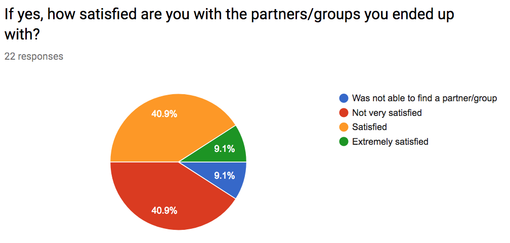

# PairWise

 > _Note:_ This document is meant to be written during (or shortly after) your review meeting, which should happen fairly close to the due date.      
 >      
 > _Suggestion:_ Have your review meeting a day or two before the due date. This way you will have some time to go over (and edit) this document, and all team members should have a chance to make their contribution.


## Iteration 01 - Review & Retrospect

 * When: 4:15 pm, Friday February 9th 2018
 * Where: Bahen Centre for Information Technology, Room 3200 

## Process - Reflection

_This entire section is optional. Note that you will have to fill it out and more for the next 3 deliverables so it's good to start soon and get feedback._

#### Decisions that turned out well

List process-related (i.e. team organization) decisions that, in retrospect, turned out to be successful.

 * Slack 
 * Tutorial meetings
 * Assignment to different tasks

 * 2 - 4 decisions.
 * Ordered from most to least important.
 * Explain why (i.e. give a supporting argument) you consider a decision to be successful.
 * Feel free to refer/link to process artifact(s).

#### Decisions that did not turn out as well as we hoped

 > **meeting time (outside of tutorials):** We tried to decide the time for meetings and the review session last weekend through Doodle. However, we cannot find a suitable time for our meetings from the result that we get from Doodle. Therefore, we arranged the review meeting a little later than what we expected.
 
 > **GitHub task board:** We were planning on use the projects feature that Github provided. In the projects feature, there are To-Do list tab, in progress tab and done tab. We thought it would be useful for orginizing our project, and update the status of each individual work. However, at the end, we did not make of good use of the the projects feature.
 
 > **Upload context to GitHub from Google Docs:** We were collaborating work through Google Docs for this diliverable. During the process that we were uploading the context in the Google Docs, we ran into few synchronized problem which is one of us uploading the context when soomeone is still working on the context. Google Docs does not send out a clear notefication for changes. 


#### Planned changes

List any process-related changes you are planning to make (if there are any)
 * find a better way to meet
 * integrate GitHub into Slack
 * test out organization system between task board and ladder

 * Ordered from most to least important.
 * Explain why you are making a change.


## Product - Review

_This entire section is mandatory._

### Goals and/or tasks that were met/completed:

 * From most to least important.
 * Refer/link to artifact(s) that show that a goal/task was met/completed.
 * If a goal/task was not part of the original iteration plan, please mention it.

#### Feature List

> The final features list describes which features must be implemented in a MVP,
> and which additioanl features can be put off until after the core functionality
> is present. This list, alongside the use case diagram, will be used as a
> springboard for designating roles and responsibilities in the coming iterations.
>
```markdown
# Features required for MVP
- web interface with user accounts (need active searches to be persistent)
- user profiles: can include profile picture, bio, skills, etc.
- allow searching for partners using (at least) these core criteria:
  - course
  - time investment
  - meeting location (on campus/online/suburbs)
- allow users to view their list of potential matches for a given search;
  should be able to click to see profile, send message, send invitation, etc.
- allow users to create multiple searches (probably one per class; this might
  be restrictive for some use cases, but I think it makes sense for MVP)
- must accommodate individuals searching for groups, groups searching for
  individuals, individuals forming pairs, etc.
- show email so people can get in touch (ideally we implement chat later so
  we can bypass email altogether)
- provide methods for users to form/disband groups, send invitations,
  accept/reject invitations
- when a group reaches its desired capacity, the group members should removed
  from the active search pool

# Bonus features
- allow chat between potential partners
  - need to look into implementation overhead for realtime chat vs. sending
    email-style messages; if there are good libraries out there, we should aim
    for chat
- mobile app (or ensure mobile-friendliness)
- search based on additional criteria; some old and new ideas include:
  - skill set, such as specific languages, frontend/backend, databases, etc
  - GPA
  - personality traits
  - schedule
- notifications when new matches are found (mobile, email, etc)
- search for teammates for side projects (easy to implement)
- search for services: tutoring, textbooks, etc. (would require more work;
  probably outside the scope of this project)
- allow use by other departments/schools/groups
- rating partners
- hide people from searches (e.g. you read their profile and don't want to
  work with them, so you can remove them from your list of matches)
```

#### Use Case Diagram

> The finished use case diagram displays all actions that can
> be performed by users of the PairWise product. It provides a detailed visual of all interactions
> and functions to be implemented, and the interactions between different parts of the program.
>
> 

#### Main Webpage UI Mockup

> The UI mockup helped to make clear exactly which options would be available to a user from
> the main page of the website. The page's art style uses a colour scheme inspired by current
> web services available at the university, such as ACORN and Blackboard.
>
> 

#### Survey Information

> Toward the end of the iteration a Google Forms survey was opened to Computer Science students
> at UofT, which gathered information about students opinions on Piazza's partner finding feature.
> Questions in the survey asked if students had experienced inadequate service from Piazza group
> finder, including poor communication, difficulty of forming groups, or inability to find
> compatible partners. The results of the survey, which was answered by 23 students, indicate
> that other students recognize the same problems in Piazza group finder that PairWise aims to
> solve, supporting the motivation behind building the application.
>
> 

> 

> 

> 

#### Goals and/or tasks that were planned but not met/completed:

> **Using a task management system:** We had two different ideas for planning tasks, monitoring their progress, and registering their completion. The first is a ticket ladder document using Google Docs, which Alex has used effectively in other contexts. The second is using a GitHub project board, which is unfamiliar to most team members, but offers smoother integration with GitHub (connecting tasks to issues and pull requests, etc.). We intended to try both methods, but we did not take the time to plan a standard task workflow that everyone should adhere to. As such, we found ourselves communicating primarily over Slack about who was working on a task at a given time. This was ineffective, as people didn't always know if certain tasks had been delegated or completed. We agree that we should try each system, come to consensus on the most effective option, and utilize that system going forward.

> **Using GitHub integration in Slack:** As described in the previous section, choosing Slack as our primary means of communication has been successful. To further improve our workflow, we planned to use Slack's GitHub integration to automatically notify team members about commits and pull requests. We have not yet been able to accomplish this as we are waiting for approval from the GitHub organization administrators, but we hope to take advantage of this feature in the next iteration.

## Meeting Highlights

Going into the next iteration, our main insights are:
 * Figuring out optimal ways for everyone to meet, so everyone is updated with project decisions
 * Deciding about the messaging/chat feature for the product
 * Using the info from use cases/UI/features list to assist with development
 * delegate front-end/back-end tasks based on people's experience/interest
 
 * 2 - 4 items
 * Short (no more than one short paragraph per item)
 * High-level concepts that should guide your work for the next iteration.
 * These concepts should help you decide on where to focus your efforts.
 * Can be related to product and/or process.
