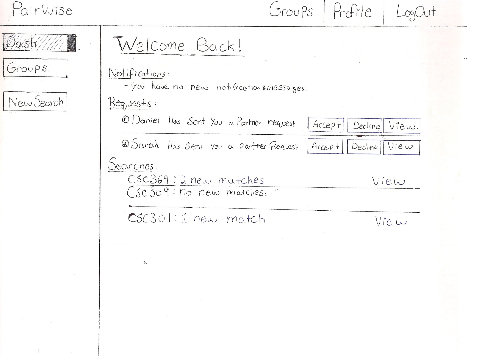
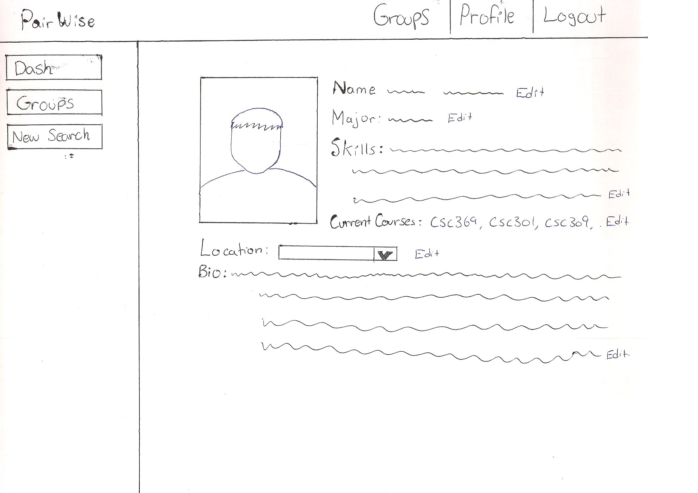

# PairWise/Group 15

 > _Note:_ This document is meant to be written during (or shortly after) your review meeting, which should happen fairly close to the due date.      
 >      
 > _Suggestion:_ Have your review meeting a day or two before the due date. This way you will have some time to go over (and edit) this document, and all team members should have a chance to make their contribution.

## Iteration 02 - Review & Retrospect

 * When: Saturday March 10th, 2018
 * Where: BA3200

## Process - Reflection

(Optional) Short introduction

#### Decisions that turned out well

List process-related (i.e. team organization) decisions that, in retrospect, turned out to be successful.

  > GitHub Issues
  >* This decision was extremely useful, as it allowed our group to work on tasks and know for certain that no one else would be. Since we could assign each task to a group member there was no confusion as to who was doing what.
  
  > Slack GitHub Feed
  >* The Slack GitHub Feed was successful as it allowed us to see when new things were pushed to the repo, and thus allowing us to get the newest version of everyfile so that when each person went to commit they could easily do so.

 * 2 - 4 decisions.
 * Ordered from most to least important.
 * Explain why (i.e. give a supporting argument) you consider a decision to be successful.
 * Feel free to refer/link to process artifact(s).

#### Decisions that did not turn out as well as we hoped

List process-related (i.e. team organization) decisions that, in retrospect, were not as successful as you thought they would be.

  >* FrontEnd / BackEnd Slack Channels
  >* Did we use the ladder?

 * 2 - 4 decisions.
 * Ordered from most to least important.
 * Feel free to refer/link to process artifact(s).

#### Planned changes

List any process-related changes you are planning to make (if there are any)

  > Move Away Front-End Back-End Slack channels
  >* We plan to move away from this format of segregated channels so that we can create a workflow that is constantly moving through each end of development. It will increase our efficiency if we are able to properly communicate with the other end so that our implementations are compatible.

 * Ordered from most to least important.
 * Explain why you are making a change.

## Product - Review

#### Goals and/or tasks that were met/completed:
  * User Interface of website
  * Database Implementation (tables)
  >* Views
  > 
  > 
  > 
  > 

 * From most to least important.
 * Refer/link to artifact(s) that show that a goal/task was met/completed.
 * If a goal/task was not part of the original iteration plan, please mention it.

#### Goals and/or tasks that were planned but not met/completed:

  * Search Function

  * Forming Groups

  * Group should be removed once formed & at capacity.

 * From most to least important.
 * For each goal/task, explain why it was not met/completed.      
   e.g. Did you change your mind, or did you just not get to it yet?
   	

## Meeting Highlights

Going into the next iteration, our main insights are:

#### Finish up user pages/views (Frontend):

> Since it was decided by the group members that this deliverable would be mostly focusing on frontend development, the creation of the user pages, that is, all the views/screens on the web page the user can visit, was important to complete in this deliverable. Though we were able to accomplish most of the views within the user’s account, features like the Group tab (in the sidebar) and the Inbox (in the navigation bar), are not functional and are yet to be implemented. On top of that, a proper login system using React as opposed to our existing login system (built with JQuery) must be created for the next deliverable to integrate with the rest of the frontend code. 

#### Connect frontend to backend (fetch from database)

> The next deliverable will heavily focus on backend development. Which includes removing all hard code and extracting and storing user information in and out of the database system. Implementing the features on the MVP that heavily rely on calculations, algorithms, communication between multiple users as well as the login system will be our main priority. One of the group members was able to create a setup of the database which will be the foundation to how the group approaches the third deliverable. 

#### Search algorithm/matching system

> The most important characteristic of the Pairwise application, with no doubt is its complex algorithmic feature which performs a search and matches potential partners to the user based on profile similarities and personalities. In this deliverable we were able to come up with a simple structure of how the search feature will be presented to the user. The search feature created is purely frontend, as it reads from api and presents a list of courses/languages/ the user can select from… In the backend, the search feature must use the user’s input and traverse through its stored list of other user profiles the output a list of results in order of best to worst match.

#### Delegation of Roles

> Since the focus of the next deliverable is going to be much different than that of this one, the delegation of tasks specific to the goals of the next deliverable is important. Roles and Responsibilities in this deliverable were not specific to one person, as many people had a chance to develop in the frontend. In the next deliverable, we plan to assign specific roles to every member so we are able to monitor every group member's progress which will allow more tasks for backend, as well as the culmination of the entire product to be completed in advance. 

