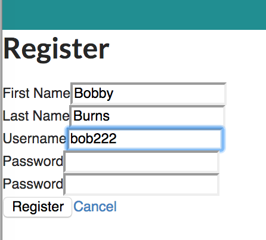
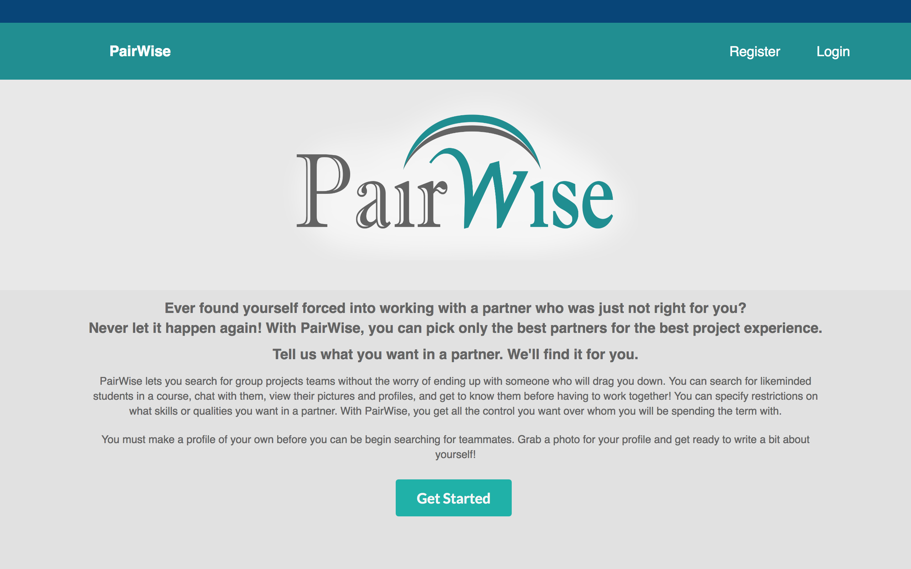

# PairWise

## Iteration 03 - Review & Retrospect

 * When: Saturday March 31, 2018, 4:00-6:00 pm
 * Where: Bahen Centre for Information Technology, BA 3200

## Process - Reflection

> As we come to the final deliverable and reflect on the progression of our development process, it is easy to see how improving our organization strategies helped the PairWise product reach completion. Our work process and GitHub workflow improved dramatically from the beginning to the end of the project, leading us to work more efficiently in later stages. For the most part, the process used in the final iteration was similar to that in the second iteration. Those techniques included using Slack for group communication, using a GitHub project taskboard to track progress, and using feature branches on the upstream repository to leave our code accessible to other developers while keeping a clean master branch. In this iteration, we restructured the way we assign tasks and manage deadlines, and tried to schedule more group work sessions. We found these strategies to improve our workflow even further than the previous iteration. More details on new and continuing processes are given below.

#### Decisions that turned out well

>* **Scheduling Meetings:**
> In this previous iteration we realized the power of group work sessions. These work sessions were typically held on weekends, and would last from early afternoon (1:00 pm) to later at night (7:00 pm to 9:00 pm). In this iteration, we tried to hold more of these meetings, and found them to be even more effective. This time, multiple developers would often be working on the same issues, of sending requests to the backend server and correctly implementing user authentication. Multiple people working on these issues, including both frontend experts and backend experts, could tackle this issue together much faster than any one person could. Communication of needs such as manipulating settings in the backend server could be carried out much more smoothly. Additionally, these work sessions continued to be an excellent time for the group to catch up on the progress of our product and plan the next stages of implementation. Group work sessions were the most important process change because they continued throughout the iteration, and served well to support the integration of features and the connection of frontend and backend. The latter point was specified to be the highest priority in this deliverable, and the former is also required to complete any kind of MVP.

>* **Backend Intermediate Deadlines:**
> Backend developers were able to implement intermediate deadlines as we had discussed in the plan meeting. Required features were separated into tickets on the GitHub task board early on, and groups of these tickets were given early deadlines. Specifically, the matching algorithm and related server endpoints such as search results and group formation were completed by Sunday March 25. This deadline was put in place so that frontend developers could have a reliable set of endpoints they could send requests to, and could begin taking these endpoints into account earlier in the iteration. The final backend feature, server authentication, was completed on Wednesday March 28 as per another intermediate deadline. Dividing the backend tasks into these two sections, as well as making a schedule of dates on which to finish the features, helped enormously to finish core backend features well before the iteration’s end. Additionally, it helped the frontend developers know which features they knew they could use. For example, the frontend could begin using all the server’s endpoints after Monday, March 26th. This was also very important to the success of the project for these reasons. It allowed backend developers to focus on other needs of the group, such as frontend styling, earlier on i the iteration and thus led large amounts of work in the frontend to be distributed, such that each developer had less to do and could finish sooner.

>* **Delegation of Roles:**
> Due to the everyone’s busy schedules during the last few weeks, it was important to delegate specific roles and responsibilities to each group member so that they could work efficiently without being slowed down trying to figure out the outlines of their roles. During our planning meeting it was decided that developers would be assigned to similar roles to what they had been working on previously. This way everyone was already the expert of the component they were designing, and could figure out its specifications without needing input from others. It was evident how this choice improved our work efficiency. Additionally, we spent an additional meeting on (date) discussing the layout and specifications of the new messaging and inbox pages, and decided exactly how these pages would be incorporated into the existing website. While this new process was convenient and did help us work quickly, we would have been able to finish without it. Additionally, other team members could have benefited from learning each other’s sections, which could have helped us integrate different features and resolve merge conflicts. This process change is therefore positioned at the bottom as the least important of the changes in this iteration.

#### Decisions that did not turn out as well as we hoped

>* **Frontend Intermediate Deadlines:**
> Unlike the backend, the frontend had a large group of developers to implement its features, and a relatively smaller set of large-scale features to work on. As a result, each frontend developer was assigned a single, well-formed task that had not been subdivided into smaller tickets. Intermediate deadlines could not be effectively assigned for these frontend tasks, and the frontend team reverted to the same system as in the previous deliverable. Each developer again had a single task to work on, which was due at the end of the iteration. Additionally, most members of the frontend team spend the first part of the iteration working on other projects, leading their work toward the PairWise application to be concentrated to the end of the iteration. Much like last time, each frontend feature began to be completed very near the end, leading the group to struggle to integrate different features together. This same struggle in the previous iteration was what inspired us to propose intermediate deadlines in the first place. The group acknowledges that properly implemented intermediate deadlines would have been helpful to lead them to complete tasks on time, and that the problem arose from overly large task assignments and other large course projects. In future iterations we would aim to revise the way we create tickets in the frontend to cater to intermediate deadlines. The failure to implement them here led the group to rush to finish its frontend elements very close to the deadline, detracting from overall product quality. For this reason it is considered the most important unsuccessful process changes in this iteration.

>* **Project Supervisor:**
> One of the plans for this iteration was to designate a pair of developers as Project Supervisors. These developers would direct online Slack meetings on Wednesday nights, which would be similar to scrum standups. Each developer would communicate what they had done and what they were planning to do. The project supervisor would keep track of intermediate deadlines and redistribute work as necessary, acting as a one-time scrum master. This idea was not carried out effectively because very few members were able to attend these meetings actively due to other commitments and projects. Afterwards, it was decided that the role was unnecessary because its purpose was carried out in in-person team work sessions already. The team was already kept up-to-date on the progress of important tasks and did not need an additional meeting to discuss that. However, intermediate deadlines were not enforced in the team work sessions as they would have been in the Wednesday standups. The choice to discontinue the standups may have played a role in the failure to implement these intermediate deadlines in the frontend.

#### Planned changes

> For the most part, the process in this deliverable was quite successful and work was performed with reasonable efficiency. In future iterations, we would try to continue holding in-person work sessions. We have learned that the project supervisor role is partially obsolete with these meetings, as everyone is kept up-to-date on the state of the project. However, we will try to incorporate the two together, and have a section of the work sessions set aside for a project supervisor to run a brief standup. This could be hard to implement, as group members arrive at these work sessions at different times, and so the standups would have to be delayed until every member was there. The most important process change, as mentioned previously, will be to try to adapt the way we define tasks in the frontend. Smaller tickets would allow us to more successfully implement intermediate deadlines, which would be very beneficial to lead us to finish quickly. With this change, we will make additional changes to support intermediate deadlines, such as deciding on the deadline for each ticket as the ticket is added to the project’s GitHub taskboard.

## Product - Review

> As discussed during our planning meeting, our goals in this iteration were to complete the majority of the features for the MVP of the PairWise product. We had decided we will be mostly focusing on acquiring functionality of the backend, polishing the frontend display, and attempting to connect the two for a fully functioning product. Further details about which goals were met and which weren’t, are provided below.

#### Goals and/or tasks that were met/completed:

>* **Connect frontend to backend**
> 	* One of our biggest intentions in this iteration was to figure out how to connect our frontend pages to the backend. As many of our group members have little to no experience in web programming, we had predicted that bridging the gap to communicate between frontend and backend would not be doable. Since our web application uses the React framework we were looking into potentially using a middleware that would connect React with Django to be able to send and retrieve data from the database. However in the end we decided to use the Axios library to send HTTP requests to our Django server and access REST endpoints, and was extremely successful in doing so. We were able to create full functionality of certain views which will be explained in detail below. 

>* **Registration Page**
>	* One of the pages with full functionality is the Registration page. As a new user, the PairWise application allows you to click on the “Register” button, and redirects you to the registration page to create an account. This page includes a form object, which lets the user register by entering details including: 
>		* First name
>		* Last name
>		* Username
>		* Password
>		* Confirm password
>	* Once the user clicks the “register” button after entering data into the fields, a POST request is sent and the user account is created in the database. 
>
> 

>* **Login Page**
>	* Another successfully built page is the Login page. This page allows a user with an existing account to login in and view their account. The returning user must click the “Login” button and will be redirected to a login page, where they will be prompted to enter their username and password. The user will not be redirected to their account until successful login.

>* **Polish the frontend**
> 	* The majority of the views/layout in the previous deliverable were hard coded and had no functionality. Therefore one of the main objectives for this deliverable was to remove most, if not all, of the dummy code so that it modelled what a first time user would see and how they would use it. Indeed, we were able to remove a significant amount of dummy code and implement functionality for certain views in the frontend. Another priority for frontend involved looking into CSS and styling, which involved fixing the overall layout and colour scheme of the website, as well as adding the PairWise logo to the splash screen. This task was shared among several members and was an ongoing process throughout the deliverable as updates were continuously being made to certain components until the desired look and consistency between page switches was achieved. Below is a visual of the PairWise splash screen, which is the starting point to the product. The colour scheme and layout will be extremely similar to the rest of the views in the application.
>
> 

#### Goals and/or tasks that were planned but not met/completed:

 * From most to least important.
 * For each goal/task, explain why it was not met/completed.      
   e.g. Did you change your mind, or did you just not get to it yet?

## Meeting Highlights

For future deliverables, our main insights would be:

 >* **Implementing a Messaging feature**
>  * During the initial stages of product development, the group had decided that a messaging/chat feature would be a useful to the purpose of the application. This messaging feature would allow group members to form chatrooms and communicate between members of the group. The messaging feature aimed to solve a problem with the current Piazza group finder by providing easier ways to form groups and communicate with them through a chatting system, instead of email. Although we were not able to build a fully functioning chat system, it is doable through React and FireBase. FireBase is a mobile and web application development platform that provides cloud messaging. Several team members attempted to connect the FireBase tools with our existing React application but could not derive success with the limited time frame. However, by using a Javascript server like Webpack implementing such a messaging feature would be extremely beneficial and improve the usability of the product.

